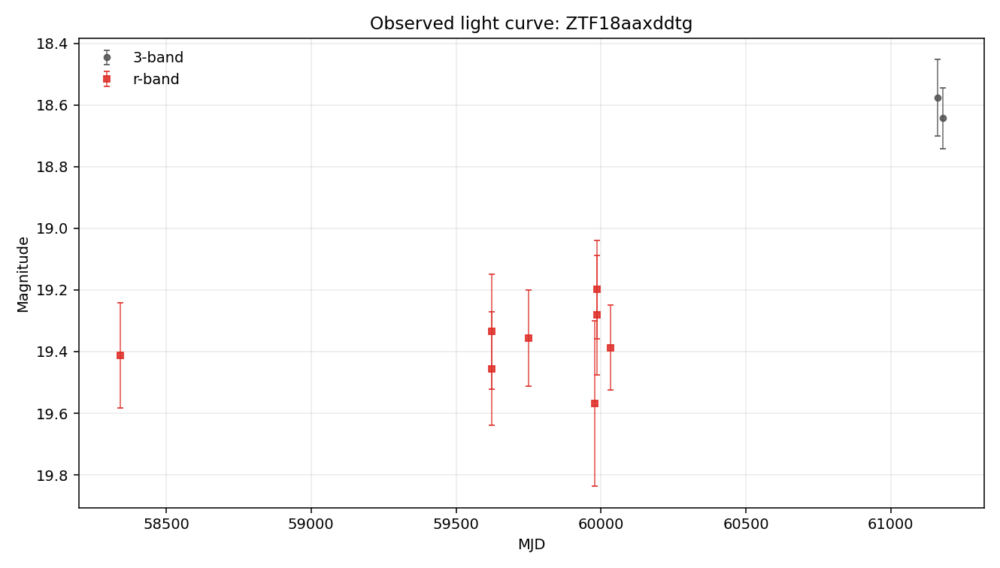
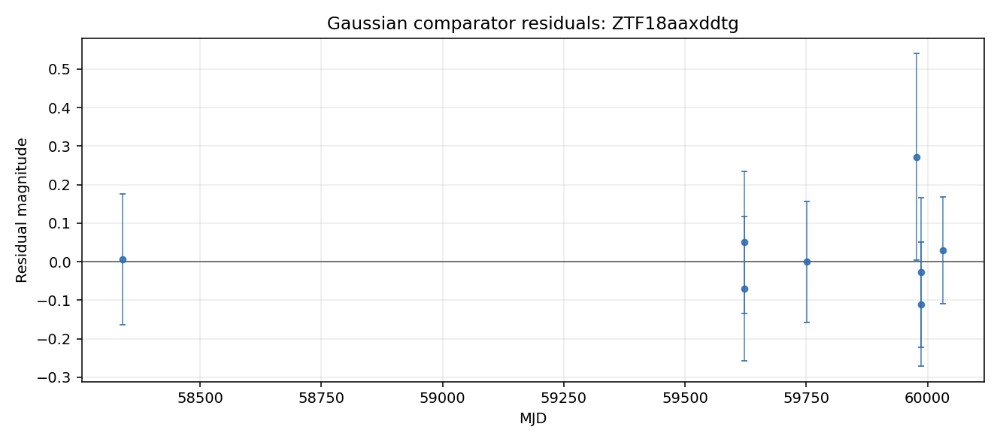

# Argus Case File: ZTF18aaxddtg

## Visual Summary

Gaussian comparator residuals show where the simple bump model under- or over-predicts the observed magnitudes.

## Evidence Narrative

- **Headline:** Mixed evidence with cautious interpretation

The Gaussian bump comparator fit the r-band detections cleanly within the reported errors. The variability texture comparator found changes that are comparable to the reported photometric errors. Together, these favor a simple one-bump description over repeated or irregular texture in the current r-band detections. Coverage appears sparse or uneven, so cadence may affect the comparison.

### Evidence Sections

- **Baseline transient-shape check** (`reasonable_fit`): The Gaussian bump comparator fit the detections reasonably within the reported errors.
- **Variability texture** (`measurement_level`): The measured changes are comparable to reported photometric errors.
- **Standard feature summary** (`computed`): Descriptive light-curve features were computed from 8 usable r-band point(s) for comparison across objects.
- **Template-family probe** (`limited`): Template-family probing was limited because required context such as redshift is unavailable.
- **Cross-survey context** (`not_requested`): External catalog context was not requested for this case-file run.

### What Argus Can Say

- Standard descriptive features are available for comparison across objects.
- No spectroscopic information is recorded in this case file.

### What Argus Cannot Say

- Argus does not identify the object type.
- Argus does not certify that the source is unusual.
- Argus does not treat broker or catalog labels as ground truth.
- Argus does not treat template-family probes as object identity.

### Recommended Next Checks

- Add verified redshift or context before interpreting template-family probes.
- Run cross-survey context if network access and optional dependencies are available.
- Inspect forced photometry around recent detections if available.

- **Caveat:** This narrative summarizes evidence layers. It is not a physical classification.

## Object Summary

- **Object ID:** ZTF18aaxddtg
- **Source date:** 2026-05-20
- **Available data sources:** parquet_detections, raw_lightcurve_json, tensor_manifest
- **Coordinates:** RA=284.452, Dec=9.60622
- **Detections:** 10
- **Non-detections:** 212
- **Filters observed:** g, r
- **First MJD:** 58263.4
- **Last MJD:** 61180.5
- **Time span days:** 2917.05
- **Schema version:** 1.12

## Classification Metadata

No broker or catalog classification metadata is attached to this case file.

Any external labels shown here are metadata only, not Argus conclusions.

## Light-Curve Summary

- **Detections:** 10
- **Non-detections:** 212
- **Filters observed:** g, r
- **First MJD:** 58263.4
- **Last MJD:** 61180.5
- **Time span days:** 2917.05
- **Most recent detection MJD:** 61180.5
- **Longest detection gap days:** 1282.25

### Per-Filter Summary

- **g:** detections=0, non_detections=78, mag_min=Not available., mag_max=Not available., delta_mag=Not available.
- **r:** detections=8, non_detections=110, mag_min=19.1985, mag_max=19.5688, delta_mag=0.370255

## Feature Summary

- **Source:** light-curve
- **Band:** r
- **Status:** computed
- **Usable points:** 8

### Feature Values

- **amplitude:** 0.185128
- **inter_percentile_range_25:** 0.125543
- **maximum_slope:** 32.7005
- **median:** 19.3713
- **median_absolute_deviation:** 0.0625625
- **standard_deviation:** 0.111725

### Feature Quality Notes

- maximum_slope is cadence-sensitive: the steepest adjacent pair is separated by 3.6 minute(s). Treat this as a sampling diagnostic, not a robust physical rate.
- Minimum adjacent detection spacing is 3.6 minute(s).

### Feature Diagnostics

- **cadence_sensitive_maximum_slope:** True
- **cadence_sensitive_slope_threshold_days:** 0.05
- **maximum_slope_pair_delta_mag:** 0.082886
- **maximum_slope_pair_delta_time_days:** 0.0025347
- **maximum_slope_pair_delta_time_minutes:** 3.64997
- **maximum_slope_pair_value_mag_per_day:** 32.7005
- **minimum_delta_time_days:** 0.0025347
- **minimum_delta_time_minutes:** 3.64997

- **Interpretation:** Descriptive light-curve features were computed for r-band detections using the light-curve package. The r-band observed brightness range is moderate (0.37 mag). Standardized scatter is moderate for this detection set (0.11 mag). These features support comparison across objects. The maximum_slope value is cadence-sensitive for this object and should be read with the feature quality notes.
- **Caveat:** Feature values are descriptive summaries only and do not identify the object type.

## Anomaly Assessment

- **Status:** available
- **Score:** 5
- **Label:** medium

### Drivers

- 10 detections provide a usable local record.
- Coverage spans 2917 days, enough to inspect long-baseline behavior.
- Both g and r observations are present for cross-band review.
- Standard descriptive light-curve features were computed.
- Tensor mask diagnostics are available (87% bins masked).

### Cautions

- maximum_slope is cadence-sensitive: the steepest adjacent pair is separated by 3.6 minute(s). Treat this as a sampling diagnostic, not a robust physical rate.
- Minimum adjacent detection spacing is 3.6 minute(s).
- Template-family probe is limited: missing_required_context.
- Catalog-context status is not_requested; external context remains limited.
- This deterministic assessment supports review triage only. It is not a classification, model verdict, or claim about physical identity.

### Input Summary

- **bands_present:** ["g", "r"]
- **brightest_to_median_delta_mag:** {"r": 0.17279850000000252}
- **cross_survey_context_status:** not_requested
- **data_sources:** ["parquet_detections", "raw_lightcurve_json", "tensor_manifest"]
- **dual_band_median_difference_mag:** Not available.
- **feature_summary_status:** computed
- **gaussian_status:** fitted_baseline
- **max_brightest_to_median_delta_mag:** 0.172799
- **max_observed_mag_range:** 0.370255
- **non_detection_count:** 212
- **observation_count:** 10
- **per_filter_mag_range:** {"r": 0.3702550000000002}
- **sncosmo_template_probe_status:** missing_required_context
- **tensor_flux_medians:** {"g": 0.0, "r": 0.0}
- **tensor_frac_bins_masked:** 0.8675
- **tensor_manifest_available:** True
- **tensor_observation_counts:** {"g": 0, "g_upper_limits": 27, "r": 0, "r_upper_limits": 29}
- **tensor_total_unmasked_bins:** 53
- **time_span_days:** 2917.05
- **variability_behavior_hint:** flat_or_measurement_level
- **variability_texture_status:** computed

- **Caveat:** This deterministic assessment supports review triage only. It is not a classification, model verdict, or claim about physical identity.

## Comparison Summary

- **Headline:** Mostly consistent with a single smooth bump

The Gaussian bump comparator fit the r-band detections cleanly within the reported errors. The variability texture comparator found changes that are comparable to the reported photometric errors. Together, these favor a simple one-bump description over repeated or irregular texture in the current r-band detections. Coverage appears sparse or uneven, so cadence may affect the comparison.

- **Caveat:** This is not a physical classification. It does not identify the object type, physical cause, or special status.
- **Recommended next check:** Inspect residuals and verify that the pattern persists with additional local photometry.

## Model Comparisons

### Gaussian bump (r-band)

- **Model type:** gaussian_bump
- **Filter used:** r
- **Status:** fitted_baseline

**Parameters**

- **amplitude_mag:** -0.176797
- **baseline_mag:** 19.4069
- **peak_mjd:** 59890.9
- **sigma_days:** 88.875

**Fit Metrics**

- **largest_abs_residual:** 0.271876
- **largest_residual_mjd:** 59977.6
- **mae:** 0.0707573
- **n_points:** 8
- **reduced_chi2:** 0.445771
- **residual_mean:** 0.0186941
- **residual_std:** 0.107449
- **rmse:** 0.109063

**Residual Summary**

- Residuals are concentrated in the most recent portion of the light curve.
- The fitted peak time falls in a region with fewer than two nearby detections; peak placement is loosely constrained.
- Coverage is highly uneven (largest gap 1282 days vs median gap 44.89 days); fit quality is limited by sparse coverage.
- Residual scatter (σ ≈ 0.11 mag) is comparable to the fitted bump amplitude (-0.18 mag) — the data is not well described by a single bump.

- **Interpretation:** A single Gaussian bump was fit to the r-band detections. RMSE = 0.11 mag, reduced χ² ≈ 0.4 — the bump shape is consistent with the data within the reported errors. See residual_summary for where the fit fails.

### Variability texture (r-band)

- **Model type:** variability_texture
- **Filter used:** r
- **Status:** computed

**Parameters**

- None recorded.

**Fit Metrics**

- **behavior_hint:** flat_or_measurement_level
- **local_extrema_count_after_smoothing:** 1
- **mag_max:** 19.5688
- **mag_median:** 19.3713
- **mag_min:** 19.1985
- **median_photometric_error_mag:** 0.17706
- **n_points:** 8
- **observed_mag_range:** 0.370255
- **range_to_error_ratio:** 2.09113
- **robust_scatter_mag:** 0.0927552
- **scatter_to_error_ratio:** 0.523864
- **sign_change_tolerance_mag:** 0.0885299
- **smoothed_sign_changes:** 1
- **smoothing_window_points:** 3
- **time_span_days:** 1692.14
- **variability_materially_larger_than_errors:** False

**Residual Summary**

- Observed r-band range: 0.37 mag; robust scatter: 0.09 mag.
- After 3-point smoothing, counted 1 local extrema/sign change(s).
- Robust scatter is comparable to the reported errors.

- **Interpretation:** The r-band detections (8 point(s)) span 0.37 mag with robust scatter 0.09 mag. After 3-point smoothing, 1 local extrema/sign change(s) were counted. The scatter is comparable to the reported photometric errors. The measured changes are small relative to the reported errors, so this check treats the sequence as measurement-level or nearly flat. This is descriptive only: it does not identify an object type, physical cause, or special status.

### sncosmo template probe

- **Model type:** sncosmo_template_probe
- **Filter used:** r
- **Status:** missing_required_context

**Parameters**

- None recorded.

**Fit Metrics**

- **bands_used:** ["r"]
- **magnitude_system:** ab
- **missing_context:** ["redshift"]
- **model_family:** sncosmo_template_family
- **n_points:** 8
- **template_name:** hsiao
- **zeropoint:** 25

**Residual Summary**

- Redshift is unavailable in the local case-file context.

- **Interpretation:** sncosmo template fitting was not attempted because redshift is unavailable. Argus does not invent redshift for template-family comparisons.

## Cross-Survey Context

- **Status:** not_requested
- **Coordinates:** Not available.
- **Search radius arcsec:** Not available.

### Sources

- None recorded.

- **Interpretation:** Cross-survey catalog context was not requested for this run.
- **Caveat:** No external catalog query was performed.

## Uncertainty and Next Checks

### Evidence Notes

- Object has 10 rb-filtered detection(s) and 212 non-detection(s) on file.
- Filters observed: g, r.
- Coverage spans MJD 58263.42 to 61180.47 (2917 days).
- Most recent detection: MJD 61180.47.
- Longest gap between consecutive detections: 1282 days.
- In g-band: 0 detections and 78 non-detection(s). Source was below detection threshold whenever ZTF looked in g.
- In r-band: 8 detection(s), magnitude 19.20–19.57 (Δm = 0.37); 110 non-detection(s).
- No external classification label is attached to this object in local data.

### Uncertainty Notes

- Cross-survey catalog context is tracked in the cross_survey_context field; default offline runs record not_requested unless the optional lookup is explicitly enabled.
- No spectroscopic information is on file.
- No forced-photometry follow-up has been requested.
- Candidate explanations above are placeholders, not fits, so mismatch magnitudes and goodness-of-fit values are not yet available.
- No external classification label is present in local data.

### Recommended Next Checks

- Run the optional cross-survey context check at RA=284.45227, Dec=9.60622 if network access and optional dependencies are available.
- Inspect archival image cutouts at this position and record any nearby source context as external metadata.
- Pull ZTF forced photometry in a plus/minus 90-day window around the most recent detection (MJD 61180.47).
- Add richer comparator families only when the required context is available, and record their residuals without treating them as object identity.
- If the source is still active (last detection within ~60 days), request follow-up spectroscopy.
