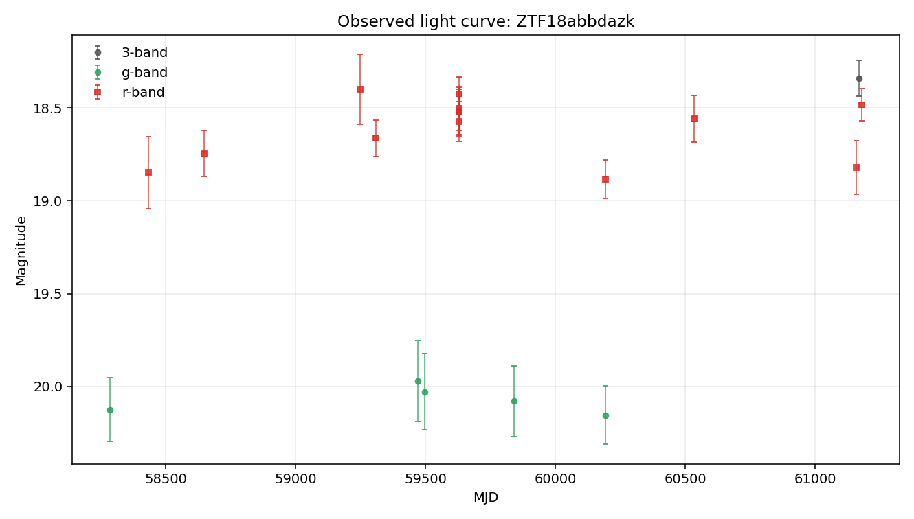
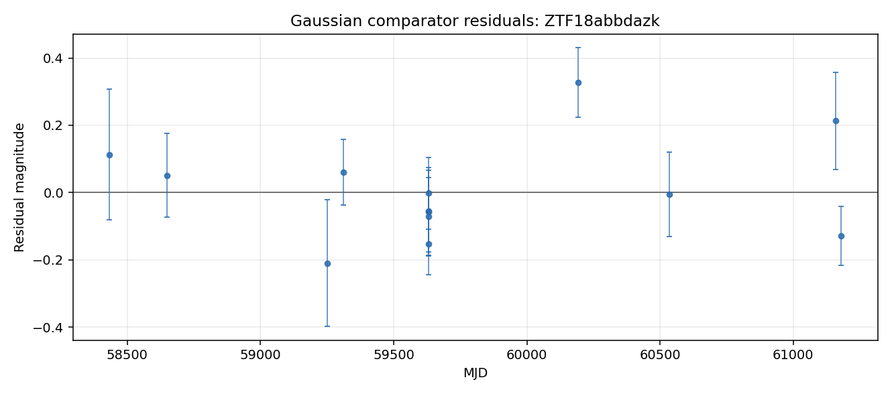

# Argus Case File: ZTF18abbdazk

## Visual Summary

Gaussian comparator residuals show where the simple bump model under- or over-predicts the observed magnitudes.

## Evidence Narrative

- **Headline:** Mixed evidence with cautious interpretation

The Gaussian bump comparator fit, but reduced chi-squared is 2.2, so the single smooth bump captures only part of the point-to-point behavior. The variability texture comparator found changes that are comparable to the reported photometric errors. Together, these suggest the r-band detections are not fully captured by one smooth bump.

### Evidence Sections

- **Baseline transient-shape check** (`not_well_fit`): The Gaussian bump comparator fit the detections but left substantial residual structure (reduced chi-squared about 2.2).
- **Variability texture** (`measurement_level`): The measured changes are comparable to reported photometric errors.
- **Standard feature summary** (`computed`): Descriptive light-curve features were computed from 13 usable r-band point(s) for comparison across objects.
- **Template-family probe** (`limited`): Template-family probing was limited because required context such as redshift is unavailable.
- **Cross-survey context** (`not_requested`): External catalog context was not requested for this case-file run.

### What Argus Can Say

- The r-band detections are not well explained by a single smooth bump.
- Standard descriptive features are available for comparison across objects.
- No spectroscopic information is recorded in this case file.

### What Argus Cannot Say

- Argus does not identify the object type.
- Argus does not certify that the source is unusual.
- Argus does not treat broker or catalog labels as ground truth.
- Argus does not treat template-family probes as object identity.

### Recommended Next Checks

- Inspect residual structure visually.
- Add verified redshift or context before interpreting template-family probes.
- Run cross-survey context if network access and optional dependencies are available.
- Inspect forced photometry around recent detections if available.

- **Caveat:** This narrative summarizes evidence layers. It is not a physical classification.

## Object Summary

- **Object ID:** ZTF18abbdazk
- **Source date:** 2026-05-20
- **Available data sources:** parquet_detections, raw_lightcurve_json, tensor_manifest
- **Coordinates:** RA=286.629, Dec=1.94183
- **Detections:** 19
- **Non-detections:** 201
- **Filters observed:** g, r
- **First MJD:** 58283.4
- **Last MJD:** 61180.4
- **Time span days:** 2897.04
- **Schema version:** 1.12

## Classification Metadata

No broker or catalog classification metadata is attached to this case file.

Any external labels shown here are metadata only, not Argus conclusions.

## Light-Curve Summary

- **Detections:** 19
- **Non-detections:** 201
- **Filters observed:** g, r
- **First MJD:** 58283.4
- **Last MJD:** 61180.4
- **Time span days:** 2897.04
- **Most recent detection MJD:** 61180.4
- **Longest detection gap days:** 623.14

### Per-Filter Summary

- **g:** detections=5, non_detections=82, mag_min=19.9722, mag_max=20.156, delta_mag=0.183842
- **r:** detections=13, non_detections=98, mag_min=18.3986, mag_max=18.8844, delta_mag=0.485804

## Feature Summary

- **Source:** light-curve
- **Band:** r
- **Status:** computed
- **Usable points:** 13

### Feature Values

- **amplitude:** 0.242902
- **inter_percentile_range_25:** 0.26614
- **maximum_slope:** 37.6421
- **median:** 18.5573
- **median_absolute_deviation:** 0.104815
- **standard_deviation:** 0.16469

### Feature Quality Notes

- maximum_slope is cadence-sensitive: the steepest adjacent pair is separated by 3.6 minute(s). Treat this as a sampling diagnostic, not a robust physical rate.
- Minimum adjacent detection spacing is 3.6 minute(s).

### Feature Diagnostics

- **cadence_sensitive_maximum_slope:** True
- **cadence_sensitive_slope_threshold_days:** 0.05
- **maximum_slope_pair_delta_mag:** 0.094542
- **maximum_slope_pair_delta_time_days:** 0.0025116
- **maximum_slope_pair_delta_time_minutes:** 3.6167
- **maximum_slope_pair_value_mag_per_day:** 37.6421
- **minimum_delta_time_days:** 0.0025116
- **minimum_delta_time_minutes:** 3.6167

- **Interpretation:** Descriptive light-curve features were computed for r-band detections using the light-curve package. The r-band observed brightness range is moderate (0.49 mag). Standardized scatter is moderate for this detection set (0.16 mag). These features support comparison across objects. The maximum_slope value is cadence-sensitive for this object and should be read with the feature quality notes.
- **Caveat:** Feature values are descriptive summaries only and do not identify the object type.

## Evidence Triage Assessment

`anomaly_assessment` is an evidence triage summary inside this case file. It summarizes available signals for review; it is not an object-identity claim.

- **Status:** available
- **Score:** 8
- **Label:** high

### Drivers

- 19 detections provide a usable local record.
- Coverage spans 2897 days, enough to inspect long-baseline behavior.
- Both g and r observations are present for cross-band review.
- The largest observed per-band magnitude range is moderate (0.49 mag).
- Median g/r magnitudes differ enough to merit cross-band inspection (1.52 mag).
- Standard descriptive light-curve features were computed.
- Gaussian bump fit leaves elevated residual structure (reduced chi-squared about 2.2).
- Tensor mask diagnostics are available (89% bins masked).

### Cautions

- maximum_slope is cadence-sensitive: the steepest adjacent pair is separated by 3.6 minute(s). Treat this as a sampling diagnostic, not a robust physical rate.
- Minimum adjacent detection spacing is 3.6 minute(s).
- Template-family probe is limited: missing_required_context.
- Catalog-context status is not_requested; external context remains limited.
- This deterministic assessment supports review triage only. It is not a classification, model verdict, or claim about physical identity.

### Input Summary

- **bands_present:** ["g", "r"]
- **brightest_to_median_delta_mag:** {"g": 0.10847099999999799, "r": 0.15868000000000038}
- **cross_survey_context_status:** not_requested
- **data_sources:** ["parquet_detections", "raw_lightcurve_json", "tensor_manifest"]
- **dual_band_median_difference_mag:** 1.52337
- **feature_summary_status:** computed
- **gaussian_status:** fitted_baseline
- **max_brightest_to_median_delta_mag:** 0.15868
- **max_observed_mag_range:** 0.485804
- **non_detection_count:** 201
- **observation_count:** 19
- **per_filter_mag_range:** {"g": 0.1838419999999985, "r": 0.4858039999999981}
- **sncosmo_template_probe_status:** missing_required_context
- **tensor_flux_medians:** {"g": 0.0, "r": 127.14203643798828}
- **tensor_frac_bins_masked:** 0.89
- **tensor_manifest_available:** True
- **tensor_observation_counts:** {"g": 0, "g_upper_limits": 28, "r": 2, "r_upper_limits": 20}
- **tensor_total_unmasked_bins:** 44
- **time_span_days:** 2897.04
- **variability_behavior_hint:** flat_or_measurement_level
- **variability_texture_status:** computed

- **Caveat:** This deterministic assessment supports review triage only. It is not a classification, model verdict, or claim about physical identity.

## Comparison Summary

- **Headline:** Single smooth bump leaves residual structure

The Gaussian bump comparator fit, but reduced chi-squared is 2.2, so the single smooth bump captures only part of the point-to-point behavior. The variability texture comparator found changes that are comparable to the reported photometric errors. Together, these suggest the r-band detections are not fully captured by one smooth bump.

- **Caveat:** This is not a physical classification. It does not identify the object type, physical cause, or special status.
- **Recommended next check:** Inspect the largest residuals and review cadence gaps before adding richer comparators.

## Model Comparisons

### Gaussian bump (r-band)

- **Model type:** gaussian_bump
- **Filter used:** r
- **Status:** fitted_baseline

**Parameters**

- **amplitude_mag:** -857.877
- **baseline_mag:** 876.434
- **peak_mjd:** 60200.9
- **sigma_days:** 86854.9

**Fit Metrics**

- **largest_abs_residual:** 0.327377
- **largest_residual_mjd:** 60193.3
- **mae:** 0.111401
- **n_points:** 13
- **reduced_chi2:** 2.2375
- **residual_mean:** 0.00625633
- **residual_std:** 0.143152
- **rmse:** 0.143288

**Residual Summary**

- No striking residual structure relative to the fit.

- **Interpretation:** A single Gaussian bump was fit to the r-band detections. RMSE = 0.14 mag, reduced χ² ≈ 2.2 — the bump shape captures the average behavior but not the point-to-point variability. See residual_summary for where the fit fails.

### Variability texture (r-band)

- **Model type:** variability_texture
- **Filter used:** r
- **Status:** computed

**Parameters**

- None recorded.

**Fit Metrics**

- **behavior_hint:** flat_or_measurement_level
- **local_extrema_count_after_smoothing:** 3
- **mag_max:** 18.8844
- **mag_median:** 18.5573
- **mag_min:** 18.3986
- **median_photometric_error_mag:** 0.121953
- **n_points:** 13
- **observed_mag_range:** 0.485804
- **range_to_error_ratio:** 3.98354
- **robust_scatter_mag:** 0.155399
- **scatter_to_error_ratio:** 1.27425
- **sign_change_tolerance_mag:** 0.0609765
- **smoothed_sign_changes:** 3
- **smoothing_window_points:** 3
- **time_span_days:** 2747.36
- **variability_materially_larger_than_errors:** False

**Residual Summary**

- Observed r-band range: 0.49 mag; robust scatter: 0.16 mag.
- After 3-point smoothing, counted 3 local extrema/sign change(s).
- Robust scatter is comparable to the reported errors.

- **Interpretation:** The r-band detections (13 point(s)) span 0.49 mag with robust scatter 0.16 mag. After 3-point smoothing, 3 local extrema/sign change(s) were counted. The scatter is comparable to the reported photometric errors. The measured changes are small relative to the reported errors, so this check treats the sequence as measurement-level or nearly flat. This is descriptive only: it does not identify an object type, physical cause, or special status.

### sncosmo template probe

- **Model type:** sncosmo_template_probe
- **Filter used:** g,r
- **Status:** missing_required_context

**Parameters**

- None recorded.

**Fit Metrics**

- **bands_used:** ["g", "r"]
- **magnitude_system:** ab
- **missing_context:** ["redshift"]
- **model_family:** sncosmo_template_family
- **n_points:** 18
- **template_name:** hsiao
- **zeropoint:** 25

**Residual Summary**

- Redshift is unavailable in the local case-file context.

- **Interpretation:** sncosmo template fitting was not attempted because redshift is unavailable. Argus does not invent redshift for template-family comparisons.

## Cross-Survey Context

- **Status:** not_requested
- **Coordinates:** Not available.
- **Search radius arcsec:** Not available.

### Sources

- None recorded.

- **Interpretation:** Cross-survey catalog context was not requested for this run.
- **Caveat:** No external catalog query was performed.

## Uncertainty and Next Checks

### Evidence Notes

- Object has 19 rb-filtered detection(s) and 201 non-detection(s) on file.
- Filters observed: g, r.
- Coverage spans MJD 58283.40 to 61180.44 (2897 days).
- Most recent detection: MJD 61180.44.
- Longest gap between consecutive detections: 623 days.
- In g-band: 5 detection(s), magnitude 19.97–20.16 (Δm = 0.18); 82 non-detection(s).
- In r-band: 13 detection(s), magnitude 18.40–18.88 (Δm = 0.49); 98 non-detection(s).
- No external classification label is attached to this object in local data.

### Uncertainty Notes

- Cross-survey catalog context is tracked in the cross_survey_context field; default offline runs record not_requested unless the optional lookup is explicitly enabled.
- No spectroscopic information is on file.
- No forced-photometry follow-up has been requested.
- Candidate explanations above are placeholders, not fits, so mismatch magnitudes and goodness-of-fit values are not yet available.
- No external classification label is present in local data.

### Recommended Next Checks

- Run the optional cross-survey context check at RA=286.62936, Dec=1.94183 if network access and optional dependencies are available.
- Inspect archival image cutouts at this position and record any nearby source context as external metadata.
- Pull ZTF forced photometry in a plus/minus 90-day window around the most recent detection (MJD 61180.44).
- Add richer comparator families only when the required context is available, and record their residuals without treating them as object identity.
- If the source is still active (last detection within ~60 days), request follow-up spectroscopy.
