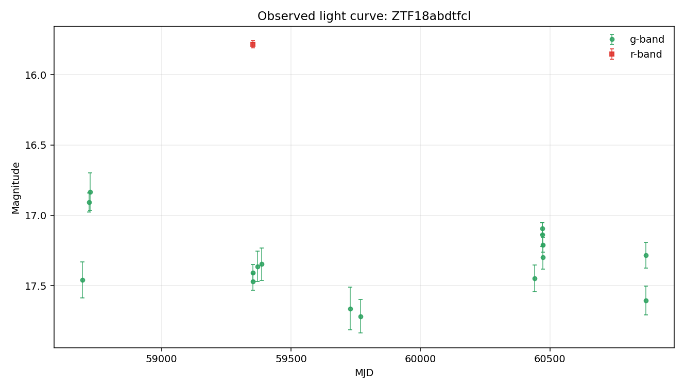

# Argus Case File: ZTF18abdtfcl

## Visual Summary

## Evidence Narrative

- **Headline:** Evidence is limited by available comparator context

Some evidence layers are missing, failed, or limited by the available local detections. The case file supports cautious review rather than a firm conclusion.

### Evidence Sections

- **Baseline transient-shape check** (`insufficient_data`): The Gaussian bump check could not be evaluated because too few usable detections were available.
- **Variability texture** (`insufficient_data`): The variability texture check could not be evaluated because too few usable detections were available.
- **Standard feature summary** (`insufficient_data`): Standard descriptive features could not be computed because too few usable detections were available.
- **Template-family probe** (`limited`): Template-family probing was limited because required context such as redshift is unavailable.
- **Cross-survey context** (`not_requested`): External catalog context was not requested for this case-file run.

### What Argus Can Say

- The current evidence supports cautious further review.
- No spectroscopic information is recorded in this case file.

### What Argus Cannot Say

- Argus does not identify the object type.
- Argus does not certify that the source is unusual.
- Argus does not treat broker or catalog labels as ground truth.
- Argus does not treat template-family probes as object identity.

### Recommended Next Checks

- Add verified redshift or context before interpreting template-family probes.
- Run cross-survey context if network access and optional dependencies are available.
- Inspect forced photometry around recent detections if available.

- **Caveat:** This narrative summarizes evidence layers. It is not a physical classification.

## Object Summary

- **Object ID:** ZTF18abdtfcl
- **Source date:** 2026-05-20
- **Available data sources:** parquet_detections, raw_lightcurve_json, tensor_manifest
- **Coordinates:** RA=254.678, Dec=-23.7459
- **Detections:** 17
- **Non-detections:** 174
- **Filters observed:** g, r
- **First MJD:** 58673.3
- **Last MJD:** 61176.4
- **Time span days:** 2503.07
- **Schema version:** 1.12

## Classification Metadata

No broker or catalog classification metadata is attached to this case file.

Any external labels shown here are metadata only, not Argus conclusions.

## Light-Curve Summary

- **Detections:** 17
- **Non-detections:** 174
- **Filters observed:** g, r
- **First MJD:** 58673.3
- **Last MJD:** 61176.4
- **Time span days:** 2503.07
- **Most recent detection MJD:** 60871.2
- **Longest detection gap days:** 672.148

### Per-Filter Summary

- **g:** detections=16, non_detections=71, mag_min=16.8319, mag_max=17.7181, delta_mag=0.886255
- **r:** detections=1, non_detections=91, mag_min=15.7832, mag_max=15.7832, delta_mag=0

## Feature Summary

- **Source:** light-curve
- **Band:** r
- **Status:** insufficient_data
- **Usable points:** 1

### Feature Values

- None recorded.

### Feature Diagnostics

- **cadence_sensitive_maximum_slope:** False
- **cadence_sensitive_slope_threshold_days:** 0.05
- **maximum_slope_pair_delta_mag:** Not available.
- **maximum_slope_pair_delta_time_days:** Not available.
- **maximum_slope_pair_delta_time_minutes:** Not available.
- **maximum_slope_pair_value_mag_per_day:** Not available.
- **minimum_delta_time_days:** Not available.
- **minimum_delta_time_minutes:** Not available.

- **Interpretation:** Standardized light-curve features were not computed for r-band: only 1 usable detection(s) were available, below the minimum of 5.
- **Caveat:** Feature values are descriptive summaries only and do not identify the object type.

## Evidence Triage Assessment

`anomaly_assessment` is an evidence triage summary inside this case file. It summarizes available signals for review; it is not an object-identity claim.

- **Status:** available
- **Score:** 7
- **Label:** high

### Drivers

- 17 detections provide a usable local record.
- Coverage spans 2503 days, enough to inspect long-baseline behavior.
- Both g and r observations are present for cross-band review.
- The largest observed per-band magnitude range is moderate (0.89 mag).
- Median g/r magnitudes differ enough to merit cross-band inspection (1.57 mag).
- Brightest-to-median magnitude delta is substantial (0.52 mag).

### Cautions

- Feature summary status is insufficient_data.
- Gaussian bump comparator status is insufficient_data.
- Variability texture status is insufficient_data.
- Template-family probe is limited: missing_required_context.
- Catalog-context status is not_requested; external context remains limited.
- Tensor coverage is sparse: 96% of band/time bins are masked.
- This deterministic assessment supports review triage only. It is not a classification, model verdict, or claim about physical identity.

### Input Summary

- **bands_present:** ["g", "r"]
- **brightest_to_median_delta_mag:** {"g": 0.5227449999999969, "r": 0.0}
- **cross_survey_context_status:** not_requested
- **data_sources:** ["parquet_detections", "raw_lightcurve_json", "tensor_manifest"]
- **dual_band_median_difference_mag:** 1.57137
- **feature_summary_status:** insufficient_data
- **gaussian_status:** insufficient_data
- **max_brightest_to_median_delta_mag:** 0.522745
- **max_observed_mag_range:** 0.886255
- **non_detection_count:** 174
- **observation_count:** 17
- **per_filter_mag_range:** {"g": 0.8862549999999985, "r": 0.0}
- **sncosmo_template_probe_status:** missing_required_context
- **tensor_flux_medians:** {"g": 0.0, "r": 0.0}
- **tensor_frac_bins_masked:** 0.9575
- **tensor_manifest_available:** True
- **tensor_observation_counts:** {"g": 0, "g_upper_limits": 7, "r": 0, "r_upper_limits": 10}
- **tensor_total_unmasked_bins:** 17
- **time_span_days:** 2503.07
- **variability_behavior_hint:** Not available.
- **variability_texture_status:** insufficient_data

- **Caveat:** This deterministic assessment supports review triage only. It is not a classification, model verdict, or claim about physical identity.

## Comparison Summary

- **Headline:** Comparison evidence is limited

The Gaussian bump comparator had insufficient r-band data (1 detection(s)), so it could not test a single smooth bump. The variability texture comparator had insufficient r-band data (1 detection(s)), so repeated or irregular texture could not be assessed. Together, these leave the light-curve shape underconstrained by the available comparator evidence.

- **Caveat:** This is not a physical classification. It does not identify the object type, physical cause, or special status.
- **Recommended next check:** Load or collect more r-band detections before interpreting comparator results.

## Model Comparisons

### Gaussian bump (r-band)

- **Model type:** gaussian_bump
- **Filter used:** r
- **Status:** insufficient_data

**Parameters**

- None recorded.

**Fit Metrics**

- **n_points:** 1

**Residual Summary**

- Only 1 detection(s) in r-band — below the minimum of 5 required to fit a 4-parameter Gaussian bump.

- **Interpretation:** No comparator was fit in r-band: not enough detections survive the quality cut.

### Variability texture (r-band)

- **Model type:** variability_texture
- **Filter used:** r
- **Status:** insufficient_data

**Parameters**

- None recorded.

**Fit Metrics**

- **minimum_points:** 5
- **n_points:** 1

**Residual Summary**

- Only 1 detection(s) in r-band - below the minimum of 5 required for the variability texture summary.

- **Interpretation:** The r-band variability check was not computed: only 1 detection(s) were available, below the minimum of 5. This does not support a conclusion about the light-curve shape.

### sncosmo template probe

- **Model type:** sncosmo_template_probe
- **Filter used:** g,r
- **Status:** missing_required_context

**Parameters**

- None recorded.

**Fit Metrics**

- **bands_used:** ["g", "r"]
- **magnitude_system:** ab
- **missing_context:** ["redshift"]
- **model_family:** sncosmo_template_family
- **n_points:** 17
- **template_name:** hsiao
- **zeropoint:** 25

**Residual Summary**

- Redshift is unavailable in the local case-file context.

- **Interpretation:** sncosmo template fitting was not attempted because redshift is unavailable. Argus does not invent redshift for template-family comparisons.

## Cross-Survey Context

- **Status:** not_requested
- **Coordinates:** Not available.
- **Search radius arcsec:** Not available.

### Sources

- None recorded.

- **Interpretation:** Cross-survey catalog context was not requested for this run.
- **Caveat:** No external catalog query was performed.

## Uncertainty and Next Checks

### Evidence Notes

- Object has 17 rb-filtered detection(s) and 174 non-detection(s) on file.
- Filters observed: g, r.
- Coverage spans MJD 58673.30 to 61176.37 (2503 days).
- Most recent detection: MJD 60871.19.
- Longest gap between consecutive detections: 672 days.
- In g-band: 16 detection(s), magnitude 16.83–17.72 (Δm = 0.89); 71 non-detection(s).
- In r-band: 1 detection(s), magnitude 15.78–15.78 (Δm = 0.00); 91 non-detection(s).
- No external classification label is attached to this object in local data.

### Uncertainty Notes

- Cross-survey catalog context is tracked in the cross_survey_context field; default offline runs record not_requested unless the optional lookup is explicitly enabled.
- No spectroscopic information is on file.
- No forced-photometry follow-up has been requested.
- Candidate explanations above are placeholders, not fits, so mismatch magnitudes and goodness-of-fit values are not yet available.
- No external classification label is present in local data.

### Recommended Next Checks

- Run the optional cross-survey context check at RA=254.67831, Dec=-23.74590 if network access and optional dependencies are available.
- Inspect archival image cutouts at this position and record any nearby source context as external metadata.
- Pull ZTF forced photometry in a plus/minus 90-day window around the most recent detection (MJD 60871.19).
- Add richer comparator families only when the required context is available, and record their residuals without treating them as object identity.
