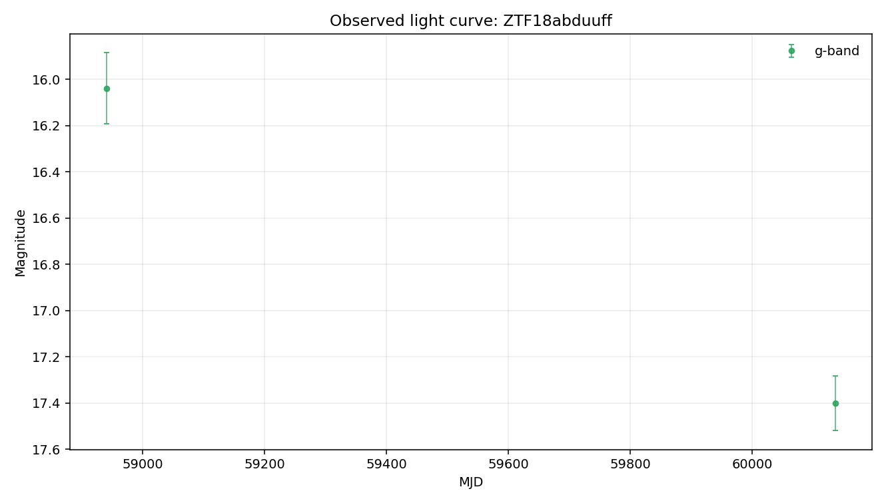

# Argus Case File: ZTF18abduuff

## Visual Summary

## Evidence Narrative

- **Headline:** Evidence is limited by available comparator context

Some evidence layers are missing, failed, or limited by the available local detections. The case file supports cautious review rather than a firm conclusion.

### Evidence Sections

- **Baseline transient-shape check** (`insufficient_data`): The Gaussian bump check could not be evaluated because too few usable detections were available.
- **Variability texture** (`insufficient_data`): The variability texture check could not be evaluated because too few usable detections were available.
- **Standard feature summary** (`insufficient_data`): Standard descriptive features could not be computed because too few usable detections were available.
- **Template-family probe** (`limited`): Template-family probing was limited because the usable detections were insufficient.
- **Cross-survey context** (`not_requested`): External catalog context was not requested for this case-file run.

### What Argus Can Say

- The current evidence supports cautious further review.
- No spectroscopic information is recorded in this case file.

### What Argus Cannot Say

- Argus does not identify the object type.
- Argus does not certify that the source is unusual.
- Argus does not treat broker or catalog labels as ground truth.
- Argus does not treat template-family probes as object identity.

### Recommended Next Checks

- Add verified redshift or context before interpreting template-family probes.
- Run cross-survey context if network access and optional dependencies are available.
- Inspect forced photometry around recent detections if available.

- **Caveat:** This narrative summarizes evidence layers. It is not a physical classification.

## Object Summary

- **Object ID:** ZTF18abduuff
- **Source date:** 2026-05-20
- **Available data sources:** parquet_detections, raw_lightcurve_json, tensor_manifest
- **Coordinates:** RA=258.226, Dec=-20.732
- **Detections:** 2
- **Non-detections:** 153
- **Filters observed:** g, r
- **First MJD:** 58634.2
- **Last MJD:** 61180.3
- **Time span days:** 2546.08
- **Schema version:** 1.10

## Classification Metadata

No broker or catalog classification metadata is attached to this case file.

Any external labels shown here are metadata only, not Argus conclusions.

## Light-Curve Summary

- **Detections:** 2
- **Non-detections:** 153
- **Filters observed:** g, r
- **First MJD:** 58634.2
- **Last MJD:** 61180.3
- **Time span days:** 2546.08
- **Most recent detection MJD:** 60136.3
- **Longest detection gap days:** 1195.87

### Per-Filter Summary

- **g:** detections=2, non_detections=57, mag_min=16.0388, mag_max=17.4006, delta_mag=1.36179
- **r:** detections=0, non_detections=67, mag_min=Not available., mag_max=Not available., delta_mag=Not available.

## Feature Summary

- **Source:** light-curve
- **Band:** r
- **Status:** insufficient_data
- **Usable points:** 0

### Feature Values

- None recorded.

- **Interpretation:** Standardized light-curve features were not computed for r-band: only 0 usable detection(s) were available, below the minimum of 5.
- **Caveat:** Feature values are descriptive summaries only and do not identify the object type.

## Anomaly Assessment

- **Status:** insufficient_data
- **Score:** 0
- **Label:** unknown

### Drivers

- Only 2 usable detection(s) are present, below the minimum for a stable review assessment.

### Cautions

- Load more local detections before using this assessment for triage.
- This deterministic assessment supports review triage only. It is not a classification, model verdict, or claim about physical identity.

### Input Summary

- **bands_present:** ["g", "r"]
- **brightest_to_median_delta_mag:** {"g": 0.6808939999999986}
- **cross_survey_context_status:** not_requested
- **data_sources:** ["parquet_detections", "raw_lightcurve_json", "tensor_manifest"]
- **dual_band_median_difference_mag:** Not available.
- **feature_summary_status:** insufficient_data
- **gaussian_status:** insufficient_data
- **max_brightest_to_median_delta_mag:** 0.680894
- **max_observed_mag_range:** 1.36179
- **non_detection_count:** 153
- **observation_count:** 2
- **per_filter_mag_range:** {"g": 1.3617880000000007}
- **sncosmo_template_probe_status:** insufficient_data
- **tensor_flux_medians:** {"g": 0.0, "r": 0.0}
- **tensor_frac_bins_masked:** 0.905
- **tensor_manifest_available:** True
- **tensor_observation_counts:** {"g": 0, "g_upper_limits": 24, "r": 0, "r_upper_limits": 32}
- **tensor_total_unmasked_bins:** 38
- **time_span_days:** 2546.08
- **variability_behavior_hint:** Not available.
- **variability_texture_status:** insufficient_data

- **Caveat:** This deterministic assessment supports review triage only. It is not a classification, model verdict, or claim about physical identity.

## Comparison Summary

- **Headline:** Comparison evidence is limited

The Gaussian bump comparator had insufficient r-band data (0 detection(s)), so it could not test a single smooth bump. The variability texture comparator had insufficient r-band data (0 detection(s)), so repeated or irregular texture could not be assessed. Together, these leave the light-curve shape underconstrained by the available comparator evidence.

- **Caveat:** This is not a physical classification. It does not identify the object type, physical cause, or special status.
- **Recommended next check:** Load or collect more r-band detections before interpreting comparator results.

## Model Comparisons

### Gaussian bump (r-band)

- **Model type:** gaussian_bump
- **Filter used:** r
- **Status:** insufficient_data

**Parameters**

- None recorded.

**Fit Metrics**

- **n_points:** 0

**Residual Summary**

- Only 0 detection(s) in r-band — below the minimum of 5 required to fit a 4-parameter Gaussian bump.

- **Interpretation:** No comparator was fit in r-band: not enough detections survive the quality cut.

### Variability texture (r-band)

- **Model type:** variability_texture
- **Filter used:** r
- **Status:** insufficient_data

**Parameters**

- None recorded.

**Fit Metrics**

- **minimum_points:** 5
- **n_points:** 0

**Residual Summary**

- Only 0 detection(s) in r-band - below the minimum of 5 required for the variability texture summary.

- **Interpretation:** The r-band variability check was not computed: only 0 detection(s) were available, below the minimum of 5. This does not support a conclusion about the light-curve shape.

### sncosmo template probe

- **Model type:** sncosmo_template_probe
- **Filter used:** g
- **Status:** insufficient_data

**Parameters**

- None recorded.

**Fit Metrics**

- **bands_used:** ["g"]
- **magnitude_system:** ab
- **model_family:** sncosmo_template_family
- **n_points:** 2
- **template_name:** hsiao
- **zeropoint:** 25

**Residual Summary**

- Only 2 usable detection(s) after filtering invalid magnitude/error values.

- **Interpretation:** sncosmo template fitting was not attempted because the available detections are not sufficient for a reliable template-family comparison.

## Cross-Survey Context

- **Status:** not_requested
- **Coordinates:** Not available.
- **Search radius arcsec:** Not available.

### Sources

- None recorded.

- **Interpretation:** Cross-survey catalog context was not requested for this run.
- **Caveat:** No external catalog query was performed.

## Uncertainty and Next Checks

### Evidence Notes

- Object has 2 rb-filtered detection(s) and 153 non-detection(s) on file.
- Filters observed: g, r.
- Coverage spans MJD 58634.25 to 61180.33 (2546 days).
- Most recent detection: MJD 60136.34.
- Longest gap between consecutive detections: 1196 days.
- In g-band: 2 detection(s), magnitude 16.04–17.40 (Δm = 1.36); 57 non-detection(s).
- In r-band: 0 detections and 67 non-detection(s). Source was below detection threshold whenever ZTF looked in r.
- No external classification label is attached to this object in local data.

### Uncertainty Notes

- No SIMBAD/NED/Gaia cross-match has been performed in Phase 2B.
- No spectroscopic information is on file.
- No forced-photometry follow-up has been requested.
- Candidate explanations above are placeholders, not fits, so mismatch magnitudes and goodness-of-fit values are not yet available.
- No external classification label is present in local data.

### Recommended Next Checks

- Cross-match position (RA=258.22591, Dec=-20.73201) against SIMBAD and NED for any known counterpart.
- Search PanSTARRS at this position for a candidate host galaxy and record offset from any nearby extended source.
- Pull ZTF forced photometry in a ±90-day window around the most recent detection (MJD 60136.34).
- Replace the Phase 2C Gaussian-bump baseline with physical templates (Type Ia SN light curve, AGN damped random walk, stellar-flare profile) and add their residuals to model_comparisons.
