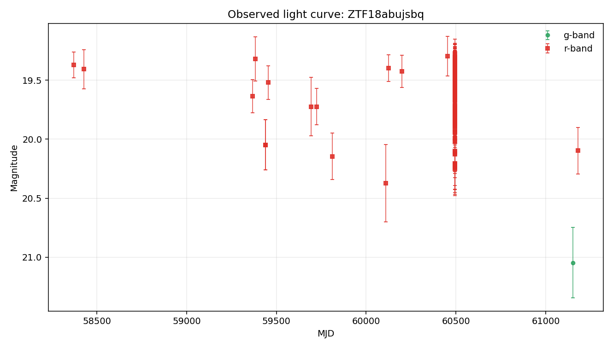
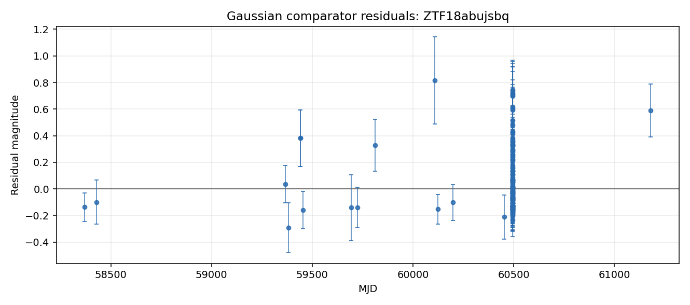

# Argus Case File: ZTF18abujsbq

## Visual Summary

Gaussian comparator residuals show where the simple bump model under- or over-predicts the observed magnitudes.

## Evidence Narrative

- **Headline:** Complex light-curve behavior with limited physical interpretation

The object is not well explained by a single smooth bump. Its r-band detections show repeated or irregular variability texture, while template and catalog-context checks remain limited by available context.

### Evidence Sections

- **Baseline transient-shape check** (`not_well_fit`): The Gaussian bump comparator fit the detections but left substantial residual structure (reduced chi-squared about 2.4).
- **Variability texture** (`complex_variability`): The light curve shows repeated or irregular directional changes (8 smoothed turn(s)) beyond a simple smooth event shape.
- **Standard feature summary** (`computed`): Descriptive light-curve features were computed from 145 usable r-band point(s) for comparison across objects.
- **Template-family probe** (`limited`): Template-family probing was limited because required context such as redshift is unavailable.
- **Cross-survey context** (`not_requested`): External catalog context was not requested for this case-file run.

### What Argus Can Say

- The r-band detections are not well explained by a single smooth bump.
- The r-band detections show repeated or irregular variability texture.
- Standard descriptive features are available for comparison across objects.
- No spectroscopic information is recorded in this case file.

### What Argus Cannot Say

- Argus does not identify the object type.
- Argus does not certify that the source is unusual.
- Argus does not treat broker or catalog labels as ground truth.
- Argus does not treat template-family probes as object identity.

### Recommended Next Checks

- Inspect residual structure visually.
- Compare against known repeated-variability behavior.
- Add verified redshift or context before interpreting template-family probes.
- Run cross-survey context if network access and optional dependencies are available.
- Inspect forced photometry around recent detections if available.

- **Caveat:** This narrative summarizes evidence layers. It is not a physical classification.

## Object Summary

- **Object ID:** ZTF18abujsbq
- **Source date:** 2026-05-20
- **Available data sources:** parquet_detections, raw_lightcurve_json, tensor_manifest
- **Coordinates:** RA=286.673, Dec=9.63316
- **Detections:** 147
- **Non-detections:** 674
- **Filters observed:** g, r
- **First MJD:** 58340.3
- **Last MJD:** 61180.4
- **Time span days:** 2840.14
- **Schema version:** 1.10

## Classification Metadata

No broker or catalog classification metadata is attached to this case file.

Any external labels shown here are metadata only, not Argus conclusions.

## Light-Curve Summary

- **Detections:** 147
- **Non-detections:** 674
- **Filters observed:** g, r
- **First MJD:** 58340.3
- **Last MJD:** 61180.4
- **Time span days:** 2840.14
- **Most recent detection MJD:** 61180.4
- **Longest detection gap days:** 938.291

### Per-Filter Summary

- **g:** detections=1, non_detections=130, mag_min=21.0457, mag_max=21.0457, delta_mag=0
- **r:** detections=146, non_detections=526, mag_min=19.2748, mag_max=20.3721, delta_mag=1.0973

## Feature Summary

- **Source:** light-curve
- **Band:** r
- **Status:** computed
- **Usable points:** 145

### Feature Values

- **amplitude:** 0.54865
- **inter_percentile_range_25:** 0.351097
- **maximum_slope:** 502.942
- **median:** 19.4947
- **median_absolute_deviation:** 0.124377
- **standard_deviation:** 0.255895

- **Interpretation:** Descriptive light-curve features were computed for r-band detections using the light-curve package. The r-band observed brightness range is wide (1.10 mag). Standardized scatter is high for this detection set (0.26 mag). These features support comparison across objects.
- **Caveat:** Feature values are descriptive summaries only and do not identify the object type.

## Anomaly Assessment

- **Status:** available
- **Score:** 10
- **Label:** high

### Drivers

- 147 detections provide a relatively dense local record.
- Coverage spans 2840 days, enough to inspect long-baseline behavior.
- Both g and r observations are present for cross-band review.
- The largest observed per-band magnitude range is wide (1.10 mag).
- Median g/r magnitudes differ enough to merit cross-band inspection (1.55 mag).
- Standard descriptive light-curve features were computed.
- Feature amplitude implies a wide observed range (1.10 mag).
- Feature scatter is high for this detection set (0.26 mag).
- Gaussian bump fit leaves elevated residual structure (reduced chi-squared about 2.4).
- Largest Gaussian residual is 0.81 mag.
- Variability texture shows repeated or irregular directional changes.
- Variability texture scatter is materially larger than typical reported errors.
- Catalog-context status is not_requested; external context remains limited.
- Tensor mask diagnostics are available (92% bins masked).

### Cautions

- Template-family probe is limited: missing_required_context.
- This deterministic assessment supports review triage only. It is not a classification, model verdict, or claim about physical identity.

### Input Summary

- **bands_present:** ["g", "r"]
- **brightest_to_median_delta_mag:** {"g": 0.0, "r": 0.22502650000000202}
- **cross_survey_context_status:** not_requested
- **data_sources:** ["parquet_detections", "raw_lightcurve_json", "tensor_manifest"]
- **dual_band_median_difference_mag:** 1.54587
- **feature_summary_status:** computed
- **gaussian_status:** fitted_baseline
- **max_brightest_to_median_delta_mag:** 0.225027
- **max_observed_mag_range:** 1.0973
- **non_detection_count:** 674
- **observation_count:** 147
- **per_filter_mag_range:** {"g": 0.0, "r": 1.0973000000000006}
- **sncosmo_template_probe_status:** missing_required_context
- **tensor_flux_medians:** {"g": 13.858620643615724, "r": 33.20390701293945}
- **tensor_frac_bins_masked:** 0.9175
- **tensor_manifest_available:** True
- **tensor_observation_counts:** {"g": 1, "g_upper_limits": 19, "r": 1, "r_upper_limits": 19}
- **tensor_total_unmasked_bins:** 33
- **time_span_days:** 2840.14
- **variability_behavior_hint:** repeated_or_irregular
- **variability_texture_status:** computed

- **Caveat:** This deterministic assessment supports review triage only. It is not a classification, model verdict, or claim about physical identity.

## Comparison Summary

- **Headline:** Not well explained by a single smooth bump

The Gaussian bump comparator fit, but reduced chi-squared is 2.4, so the single smooth bump captures only part of the point-to-point behavior. The variability texture comparator found repeated or irregular directional changes (8 smoothed turn(s)) and the scatter is larger than typical reported errors. Together, these suggest the r-band light curve is more complex than a single clean one-bump event. Coverage appears sparse or uneven, so cadence may affect the comparison.

- **Caveat:** This is not a physical classification. It does not identify the object type, physical cause, or special status.
- **Recommended next check:** Inspect the residual structure and compare against known repeated-variability behavior.

## Model Comparisons

### Gaussian bump (r-band)

- **Model type:** gaussian_bump
- **Filter used:** r
- **Status:** fitted_baseline

**Parameters**

- **amplitude_mag:** 0.357512
- **baseline_mag:** 19.5076
- **peak_mjd:** 59702.1
- **sigma_days:** 205.354

**Fit Metrics**

- **largest_abs_residual:** 0.813989
- **largest_residual_mjd:** 60108.4
- **mae:** 0.190765
- **n_points:** 146
- **reduced_chi2:** 2.35454
- **residual_mean:** 0.0715583
- **residual_std:** 0.251967
- **rmse:** 0.261932

**Residual Summary**

- Coverage is highly uneven (largest gap 938 days vs median gap 0.00 days); fit quality is limited by sparse coverage.
- Residual scatter (σ ≈ 0.25 mag) is comparable to the fitted bump amplitude (0.36 mag) — the data is not well described by a single bump.

- **Interpretation:** A single Gaussian bump was fit to the r-band detections. RMSE = 0.26 mag, reduced χ² ≈ 2.4 — the bump shape captures the average behavior but not the point-to-point variability. See residual_summary for where the fit fails.

### Variability texture (r-band)

- **Model type:** variability_texture
- **Filter used:** r
- **Status:** computed

**Parameters**

- None recorded.

**Fit Metrics**

- **behavior_hint:** repeated_or_irregular
- **local_extrema_count_after_smoothing:** 8
- **mag_max:** 20.3721
- **mag_median:** 19.4998
- **mag_min:** 19.2748
- **median_photometric_error_mag:** 0.12814
- **n_points:** 146
- **observed_mag_range:** 1.0973
- **range_to_error_ratio:** 8.56327
- **robust_scatter_mag:** 0.192464
- **scatter_to_error_ratio:** 1.50198
- **sign_change_tolerance_mag:** 0.0640701
- **smoothed_sign_changes:** 8
- **smoothing_window_points:** 5
- **time_span_days:** 2810.29
- **variability_materially_larger_than_errors:** True

**Residual Summary**

- Observed r-band range: 1.10 mag; robust scatter: 0.19 mag.
- After 5-point smoothing, counted 8 local extrema/sign change(s).
- Robust scatter is materially larger than the reported errors.

- **Interpretation:** The r-band detections (146 point(s)) span 1.10 mag with robust scatter 0.19 mag. After 5-point smoothing, 8 local extrema/sign change(s) were counted. The scatter is materially larger than the reported photometric errors. The smoothed sequence has multiple meaningful turns, which suggests repeated or irregular brightness changes more than one smooth bump. This is descriptive only: it does not identify an object type, physical cause, or special status.

### sncosmo template probe

- **Model type:** sncosmo_template_probe
- **Filter used:** g,r
- **Status:** missing_required_context

**Parameters**

- None recorded.

**Fit Metrics**

- **bands_used:** ["g", "r"]
- **magnitude_system:** ab
- **missing_context:** ["redshift"]
- **model_family:** sncosmo_template_family
- **n_points:** 147
- **template_name:** hsiao
- **zeropoint:** 25

**Residual Summary**

- Redshift is unavailable in the local case-file context.

- **Interpretation:** sncosmo template fitting was not attempted because redshift is unavailable. Argus does not invent redshift for template-family comparisons.

## Cross-Survey Context

- **Status:** not_requested
- **Coordinates:** Not available.
- **Search radius arcsec:** Not available.

### Sources

- None recorded.

- **Interpretation:** Cross-survey catalog context was not requested for this run.
- **Caveat:** No external catalog query was performed.

## Uncertainty and Next Checks

### Evidence Notes

- Object has 147 rb-filtered detection(s) and 674 non-detection(s) on file.
- Filters observed: g, r.
- Coverage spans MJD 58340.30 to 61180.44 (2840 days).
- Most recent detection: MJD 61180.44.
- Longest gap between consecutive detections: 938 days.
- In g-band: 1 detection(s), magnitude 21.05–21.05 (Δm = 0.00); 130 non-detection(s).
- In r-band: 146 detection(s), magnitude 19.27–20.37 (Δm = 1.10); 526 non-detection(s).
- No external classification label is attached to this object in local data.

### Uncertainty Notes

- No SIMBAD/NED/Gaia cross-match has been performed in Phase 2B.
- No spectroscopic information is on file.
- No forced-photometry follow-up has been requested.
- Candidate explanations above are placeholders, not fits, so mismatch magnitudes and goodness-of-fit values are not yet available.
- No external classification label is present in local data.

### Recommended Next Checks

- Cross-match position (RA=286.67280, Dec=9.63316) against SIMBAD and NED for any known counterpart.
- Search PanSTARRS at this position for a candidate host galaxy and record offset from any nearby extended source.
- Pull ZTF forced photometry in a ±90-day window around the most recent detection (MJD 61180.44).
- Replace the Phase 2C Gaussian-bump baseline with physical templates (Type Ia SN light curve, AGN damped random walk, stellar-flare profile) and add their residuals to model_comparisons.
- If the source is still active (last detection within ~60 days), request follow-up spectroscopy.
